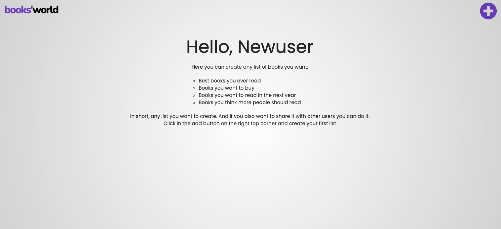

## User Stories

1. As a user, I want to easily understand the main purpose of the site and learn more about the organisation.

- **TEST**: After the users load the page the first thing sees on the home page is a brief explanation of what they will encounter on the website.

2. As a user, I want to easily to sign up to the website.

- **TEST**: Also in the home, there are two buttons redirecting to the Sign Up page and large screens and one button on small screens.

3. As a user, I want to easily log in on my account.

- **TEST**: With two clicks the users can easily login into their accounts.

4. As a user, I want to write personal summaries and main insights about the books I'm readying or alredy read.

- **TEST**: After the user creates an account or login into it, they will be redirected to the Profile page, where they create personal book reviews, they write whatever they want in these reviews.

5. As a user, I want to create a list of books and share it with other users.

- **TEST**: On the Best Books page, the users can create any lists of books they want. When creating the list they have the option to share it or not, if they decide to share, it will be seen by other users on the Discover page.

6. As a user, I want to find list of books from other people, and get inspired to read other books.

- **TEST**: As mention before, on the Discover page the users can see lists of books shared by other users. Clicking on the lists the users will be redirected to a page where they can see the books. BY clicking on one of the books they will be redirect to a page where they can see the books in more detail and also buttons that will redirect to a vendor.

7. As a user, I want to easily find a way to buy the books in the lists.

- **TEST**: When the user adds a new book to a list, there is an input field where they can add the URL to a vendor, the users can add up to three vendors for future comparison.

8. As a user, I want to uptade or delete old book summaries and lists of books.

- **TEST**: There are buttons where the user can update or delete any book summary or list of books they want. It's important to say that if the user decides to share a list of books, only the creator of the list will be able to update or delete the list. 

## Navigaton links redirect to the desired pages
- Checked if all links in the navigation bar and check if they redirect to the desired pages.
- Checked if the social link on the footer redirect to the desired page.
- **Home Page**:
    - Checked if the Sign Up button redirect to the Sign Up page.
- **Sign Up/Login Pages**:
    - Checked if the Sign Up and Log in anchor redirect to the desired pages.
- **Profile Page**:
    - Checked if Add Book Button display the Add Book modal when clicked.
    - Checked if by clicking and cover of the book reviews redirect to the desired page.
- **View Book Page**:
    - Checked if the Done, Edit and Delete button work properly.
- **Best Books Page**:
    - Checked if the Add List Button displays the Add List modal when clicked.
    - Checked if the See Books button redirect to the desired page:
    - Checked if by clicking in the list name the user is redirect to the same page if the user clicked in the See Books button.
- **View List Page**:
    - Checked if the Done, Edit and Delete button work properly.
    - Checked if the user is redirect to the correct page when click and a book cover.
- **Book Info Page**:
    - Checked if the Done, Edit and Delete button work properly.
    - Checked if the buy buttons redirect to the disered pages.
- **Discover Page**:
    - Checked if the See Books button redirect to the desired page:
    - Checked if by clicking in the list name the user is redirect to the same page if the user clicked in the See Books button.
## Pages contain all content and functionalities work as desired
### Home
- Verified if the Sign Up button only appears if the user is not already logged in.
### Sign Up/Log In
- Checked if an user attemot to sign up or log in with a spiecial characters and ensure an error message displays for each fieldalerting the user of valid form input. 
- Checked if a flash message displays if the user enter an user that already exist or the incorrect username and/or password.
### Profile
- Checked if a flash massage encouranging the user add the first book summary after sign up displays.
- Checked if the Add Book modal works and add the book sumarry into the database.
- Checked in the random quotes displays randomly on large screens.
### View Book
- Checked if the delete book functionality works.
- Checked if the edit book functionality works.
### Best Books
- Checked if a message, encouraging the user to create their first list, displays when the user hasn't created the first list yet.

## Responsive Test
- Test responsiveness of website on all screen sizes using diffent browsers(Google Chome, Opera, Firefox and Microsoft Edge)
    - Using Devtools test if everything displays as it should from 300px width up to 1920px.
- Viewed of different physical devices: Iphone 8(375px), Iphone 11(414px), Xiaomi Redmi 9(393px), medium laptop(1280px), large desktop screen(1920px).
- Repeat test in all pages.